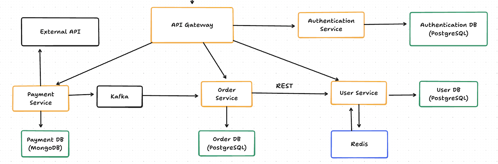

# Микросервисная E-Commerce Платформа

Продвинутое, масштабируемое приложение на базе микросервисной архитектуры, демонстрирующее современные практики бэкенд-разработки. Система состоит из **API Gateway**, сервиса аутентификации (**Authentication Service**) и трех основных бизнес-микросервисов (**User, Order, Payment**), каждый из которых управляет собственной изолированной базой данных.

## Технологический стек
- **Core:** Java 21+, Spring Boot 3.4.0+
- **Базы данных:** PostgreSQL, MongoDB
- **Кэширование:** Redis
- **Брокер сообщений:** Apache Kafka
- **Инфраструктура и DevOps:** Docker, Docker Compose, Kubernetes (Minikube), GitHub Actions
- **Инструменты и Библиотеки:** MapStruct, Liquibase, TestContainers, MockMvc, Spring Cloud Gateway, Resilience4j

---

## Архитектура системы и сервисы

### 1. API Gateway
Построен на **Spring Cloud Gateway** и **WebFlux**.
- **Централизованная маршрутизация и безопасность:** Выступает в качестве единой точки входа. Содержит фильтр безопасности, который перехватывает запросы и валидирует JWT токены (за исключением `/login` и `/register`).
- **Распределенные транзакции:** Кастомный процесс регистрации пользователя оркестрирует сохранение учетных данных в Auth Service и данных пользователя в User Service, предоставляя методы отката (rollback) в случае сбоя транзакции.

### 2. Authentication Service
Управляет идентификацией и контролем доступа.
- **Асимметричное шифрование JWT:** Генерирует access и refresh токены, подписанные закрытым ключом. Другие микросервисы запрашивают открытый ключ для независимой проверки подписей токенов.
- **Безопасное хранение:** Пароли хешируются с использованием **BCrypt** с уникальной солью и сохраняются в выделенной базе данных PostgreSQL.

### 3. User Service
Управляет профилями пользователей, картами и ролями (`admin`, `user`).
- **Кэширование:** Использует **Redis** для кэширования информации о пользователях и картах со строгой инвалидацией кэша при обновлении/удалении.
- **Управление доступом на основе ролей (RBAC):** Администраторы имеют глобальный доступ, в то время как обычные пользователи могут получать доступ только к своим собственным ресурсам через ID, извлеченный из JWT.
- **Событийно-ориентированный отзыв доступа (Transactional Outbox):** *В случае блокировки пользователя в User Service, сообщение о блокировке сохраняется в базу данных с использованием паттерна Transactional Outbox. Затем это сообщение публикуется в Kafka и передается в Auth Service, давая ему указание прекратить выдачу токенов для этого конкретного пользователя.*

### 4. Order Service
Управляет жизненным циклом заказов.
- **Реляционные данные:** Использует PostgreSQL (`orders`, `order_items`, `items`) с **Liquibase** для создания схем и **JPA Auditing** (`CreatedAt`, `UpdatedAt`). Реализовано мягкое удаление (soft delete).
- **Продвинутые запросы:** Использует Spring Data JPA `Specifications` для пагинации и фильтрации по диапазону дат и статусам.
- **Отказоустойчивость:** Взаимодействует с User Service через REST для получения данных пользователя, защищен паттерном **Circuit Breaker**.

### 5. Payment Service
Обрабатывает транзакции и управляет статусами платежей.
- **NoSQL хранилище:** Использует **MongoDB** (коллекция `payments`) для хранения записей о транзакциях.
- **Внешняя интеграция:** Вызывает внешний API для генерации случайного числа, имитируя обработку платежа (Четное = `SUCCESS`, Нечетное = `FAILED`).
- **Событийно ориентированная система:** Выступает в роли **Kafka Producer** для отправки события `CREATE_PAYMENT`, содержащего статус. Order Service выступает в роли **Kafka Consumer**, прослушивая это событие для обновления соответствующего статуса заказа.

---

## Паттерны коммуникации
- **Синхронные (REST):** Слой контроллеров (оперирующий DTO, конвертируемыми через MapStruct) обрабатывает межсервисные REST вызовы. DTO ответов обернуты в `ResponseEntity`.
- **Асинхронные (Kafka):** Событийно-ориентированная коммуникация для доменных событий, обеспечивающая слабую связность и высокую доступность.

---

## Обеспечение качества и CI/CD
- **Тестирование:** Полноценные Unit-тесты для всех методов слоя Service. Глубокие интеграционные тесты с использованием **TestContainers** и **MockMvc** для проверки всего потока от Controller до слоя БД.
- **CI Пайплайны:** Рабочие процессы **GitHub Actions** запускаются при `git push`, выполняя: Build -> Testing -> Artefact Creation (Docker Image).

---

## Развертывание и Оркестрация
- **Docker Compose:** Настроены два профиля Spring (`local` и `docker`). Compose-файл поднимает все микросервисы, базы данных (Postgres, Mongo), Redis и инстанс Kafka для полноценной локальной среды.
- **Kubernetes (Minikube):** Вся система контейнеризована и готова к развертыванию в кластере k8s.
    - **Probes (Пробы):** Настроены пробы `liveness` и `readiness` для всех сервисов.
    - **Сеть:** `Services` в Kubernetes управляют связью между подами.
    - **Ingress:** Ingress-контроллер маршрутизирует внешний трафик в кластер.
